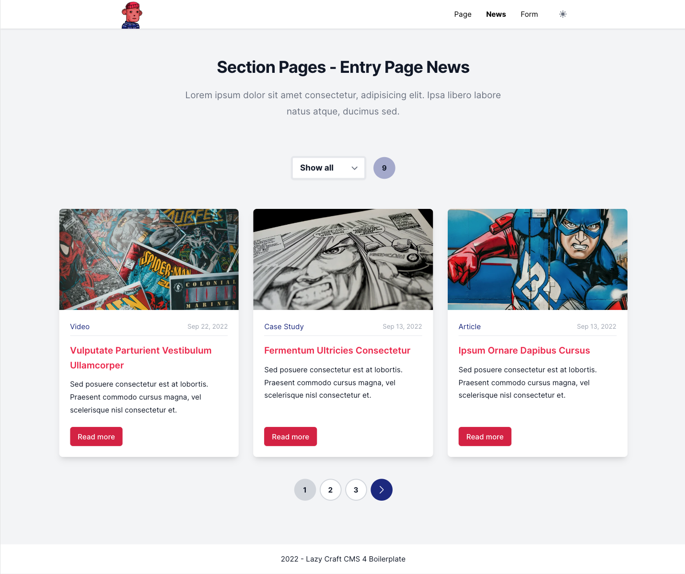
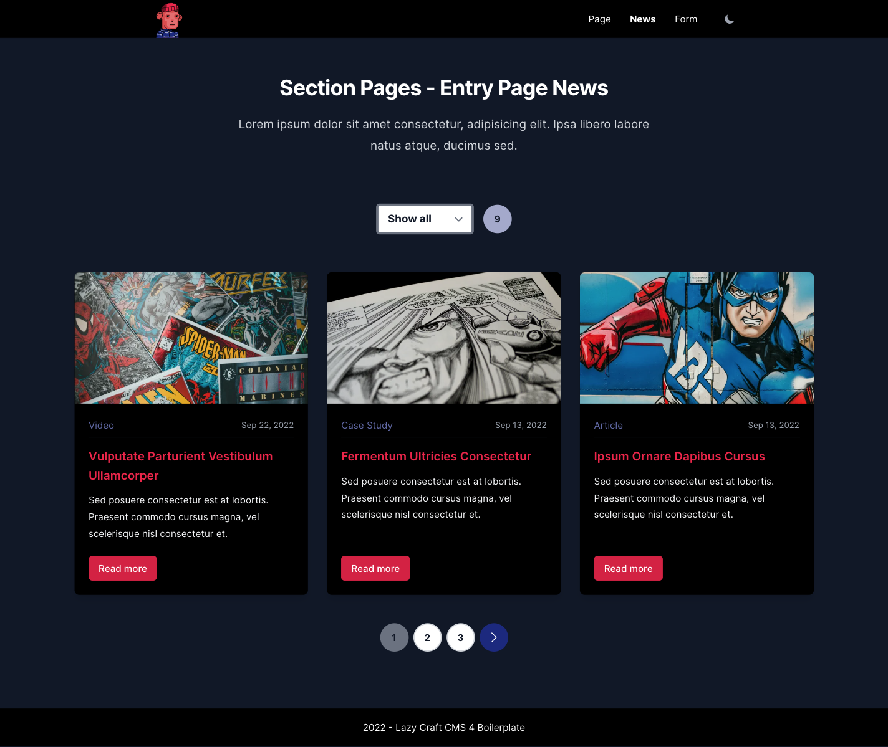

<h1>Lazy Craft CMS 4 Boilerplate</h1>

Simple lazy responsive starter kit for CraftCMS 4 Projects.

## Requirements

RTFM [Craft CMS 4 Requirements](https://craftcms.com/docs/4.x/requirements.html)

## Configs

Duplicate the .env.example file as .env and do your settings! Be sure that your `SITE_URL` points to the `/web` directory.

## DB

Use the boilerplate.sql as starting point. Create a new database with the settings from your .env file and import the boilerplate.sql into it. The login credentials are: admin:superuser

## Development

- `npm run dev` start local dev server
- `npm run build` build

Check `Vite.js` and [vitejs Documentation](https://vitejs.dev/) for more Informations!

## Whats inside?

### Stack

- [Craft CMS](https://craftcms.com/)
- [Vite.js](https://vitejs.dev/)
- [TailwindCSS](https://tailwindcss.com/)
- [Alpine.js](https://alpinejs.dev/)
- [Sprig/htmx](https://htmx.org/)
- [GraphQL](https://graphql.org/)

### Plugins (free)

- [Elements Panel](https://plugins.craftcms.com/elements-panel?craft4)
- [Vite](https://plugins.craftcms.com/vite?craft4)
- ~~[Redactor](https://plugins.craftcms.com/redactor?craft4)~~
- [CKEditor](https://plugins.craftcms.com/ckeditor?craft4) 
- [Seomate](https://plugins.craftcms.com/seomate?craft4)
- [Sprig](https://plugins.craftcms.com/sprig?craft4)
- [Super Table](https://plugins.craftcms.com/super-table?craft4)
- [Typed link field](https://plugins.craftcms.com/typedlinkfield?craft4)

### Sections

- Single - Home
- Structure - Pages (Page Default, Page News Index)
- Structure - Navigation
- Channel - News
- Channel - Categories

### ~~Categories~~

- ~~News Categories~~

### Highlights

- ContentBuilder (Text, Images, Cards, Teaser, Accordion)
- Native Image Transform Twig Component with webp, lazyloading and srcset support
- Sprig/htmx news pagination (pages or loadmore button)
- Simple Alpinejs/GraphQL News Counter
- Darkmode
- EagerLoading
- Tailwind Form Style Testpage
- Seo Fields

## Do you need more than a lazy boilerplate?

Check out [CraftCMS Baukasten](https://github.com/davidhellmann/craftcms-baukasten) from [David Hellmann](https://github.com/davidhellmann)
